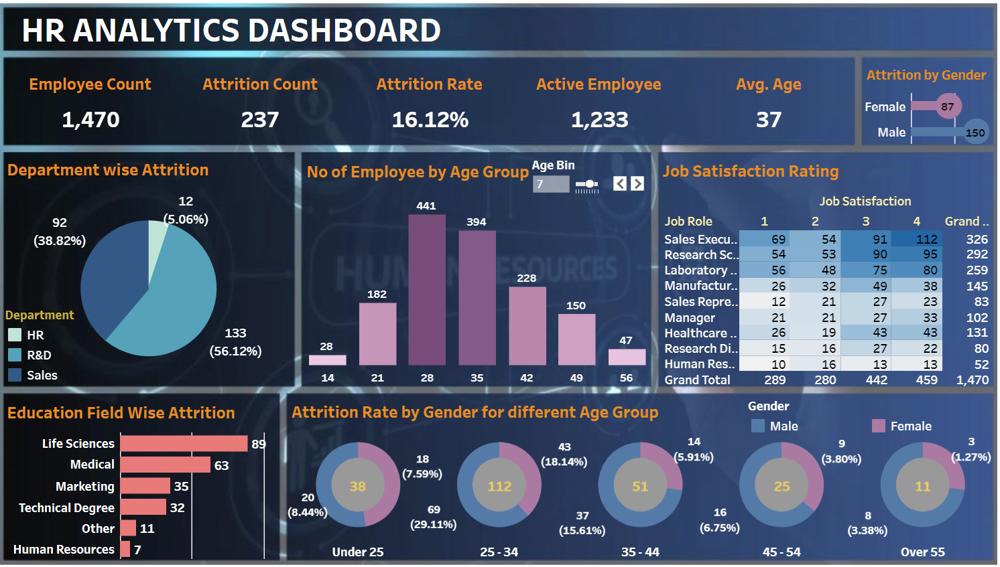

# HR_Analytics - Tableau

Link to [Dashboard](https://public.tableau.com/app/profile/y.nguyen4450/viz/HR_Data_Analytic/HRDashboard#1)

Link to [Dataset](https://docs.google.com/spreadsheets/d/17OCumMszS4xNSprNRWbnNRCzCSzxy90VLT_2zjhUk5I/edit#gid=2089618187)

## Task List
- Tạo Dashboard

## Analyst View

    

## Learnt things from this project
- Tìm hiểu về Tableau:  
    - Liên kết với dữ liệu
    - Biết về các chart và cách sử dụng: Bar Chart, Pie Chart, Highlight Table, Text Table, Donurt Chart, ...
    - Tạo và sử dụng Calculation Field, Table Calculation,..
    - Thiết kế Dashboard
    - Sử dụng Parameter
- Tìm hiểu về Knowleadge Domain của HR